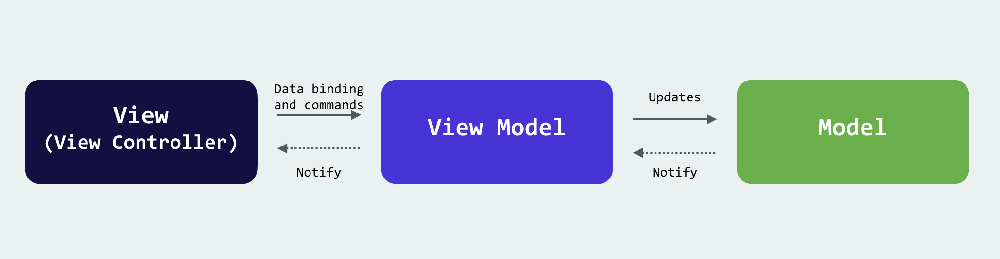
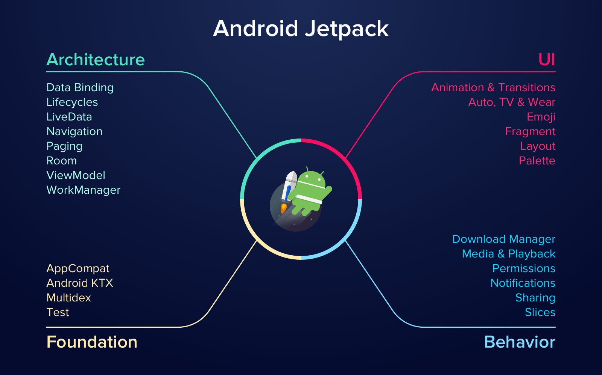

# MVVM & Android Jetpack

## MVVM in Android Kotlin

## Android Jetpack in Kotlin

  
> List of tutorials

1. DataBinding : <a href="https://github.com/alirezabashi98/MVVM/tree/step1">Step 1 mvvm</a> 
2. DataBinding : <a href="https://github.com/alirezabashi98/MVVM/tree/step2">Step 2 mvvm</a> 
3. Lifecycles : <a href="https://github.com/alirezabashi98/MVVM/tree/step3">Step 3 mvvm</a> 
4. LiveData : <a href="https://github.com/alirezabashi98/MVVM/tree/step4">Step 4 mvvm</a> (Soon...)
